# Introduction

[EIP-6551](https://eips.ethereum.org/EIPS/eip-6551) enhances the features of NFTs (ERC721 tokens) by giving each token its own smart contract account, also known as token-bound accounts (TBA). These smart contract accounts equip NFTs with the ability to operate like traditional blockchain wallets, allowing state changes and features such as holding ERC-20 tokens, other NFTs, and ether. Programmable accounts open up a myriad of use cases, limited only by the developer's imagination and the protocol's constraints.

Use cases:

- **Gaming** - A character, represented as an NFT, can possess its own inventory (like weapons, gold, etc.) using a smart wallet
- **Investing** - Utilize NFTs and their smart contract accounts to organize assets and sell entire investment portfolios in a single transaction
- **Social (DAOs)** - NFTs representing DAO membership can now maintain their own transaction history

Importantly, EIP-6551 is backwards compatible and doesn't mandate custom logic within the NFT smart contract. This compatibility allows NFT projects that were created before the introduction of EIP-6551 to adopt smart contract accounts via a [permissionless registry](https://eips.ethereum.org/EIPS/eip-6551#registry).

# Create an NFT with a Token Bound Account

This guide demonstrates how to create and interact with three smart contracts:

1. An [ERC721](https://docs.openzeppelin.com/contracts/4.x/erc721) smart contract that serves as our NFT.
2. A [registry contract](https://eips.ethereum.org/EIPS/eip-6551) that deploys smart contract account associated with a given ERC-721 and computes the token bound account address.
3. A token bound account contract that can send and receive ether and other ERC-20 tokens.

## Tools

We will use a few tools to write and deploy our smart contracts:

- [Hardhat](https://hardhat.org/): Helps deploy and interact with smart contracts.
- [Node.js](https://nodejs.org/en): Developer environment.
- [OpenZeppelin](https://www.openzeppelin.com/contracts): An open library for building secure smart contracts.
- [Coinbase Wallet](https://www.coinbase.com/wallet/): Non-custodial wallet for creating accounts and interacting with the blockchain.

## Getting started

We will be deploying these smart contracts on the [Base](https://docs.base.org/) Goerli testnet allowing us to see transaction information on [BaseScan](https://goerli.basescan.org/).

This means we will need to obtain testnet funds from a [faucet](https://coinbase.com/faucets) to deploy and interact with our smart contracts.

### Enable Testnets

1. Click on the Settings tab

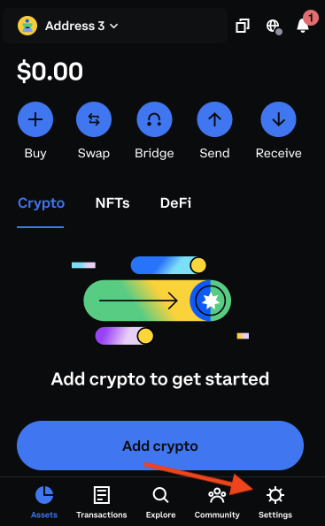

2. Select "Developer Settings"

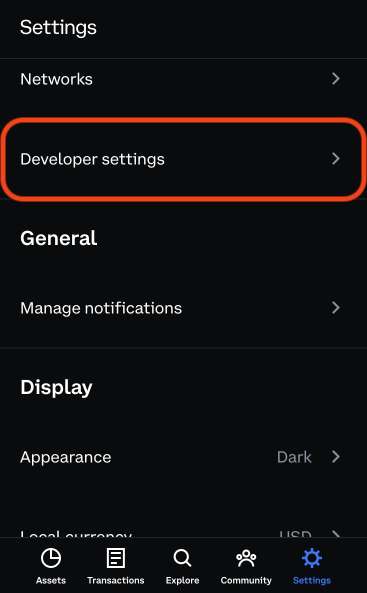

3. Toggle "Testnets" on

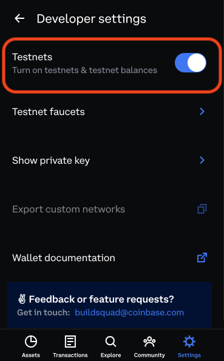

### Request Testnet Funds

1. Click on the Settings tab


2. Select "Networks"

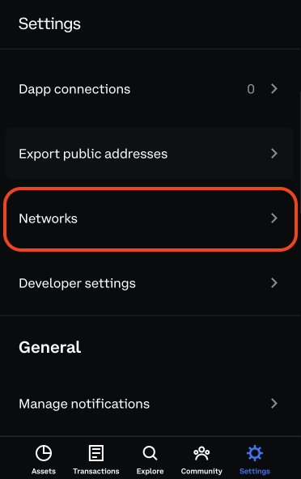

3. Select "Testnets" tab

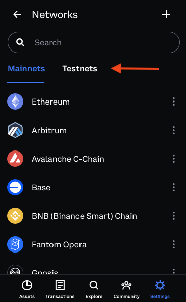

4. Click on the water (💧) icon

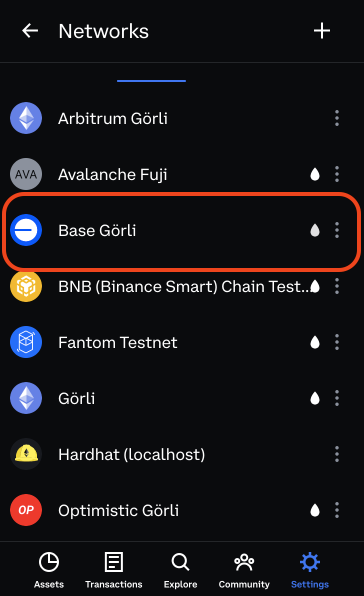

5. Request testnet funds

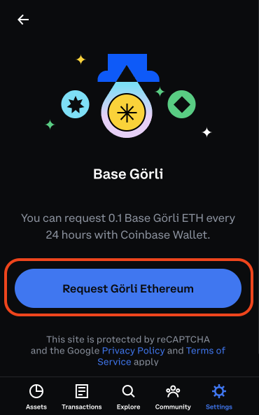

## Environment Setup

1. Clone this repo.
2. Change into the directory using `cd erc-6551-implementation`.
3. Initiate a node project and install hardhat:
   ```bash
   npm install
   ```
4. Create a .env file in the root (erc-6551-implementation/) folder by typing
   `touch .env`
5. Add the following code to your .env file:
   ```
   WALLET_KEY=<Private Key of an account>
   WALLET2_ADDR=<Address of an additional wallet>
   WALLET2_KEY=<Private key of an additional account>
   ```

Be sure to replace the values of each variable using the address and private keys obtained from the Wallet setup section

## Wallet Setup

Assuming you have set up your wallet (and safely stored away your seed phrase) and have some funds (testnet or mainnet), let's obtain the addresses and private keys needed for the demo.

### Switch Wallets + Copy Address

1. From the assets tab, click on the current address/account

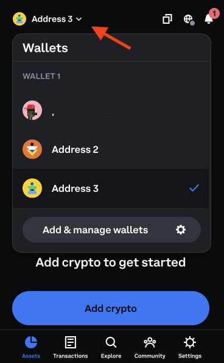

2. Select another wallet/account

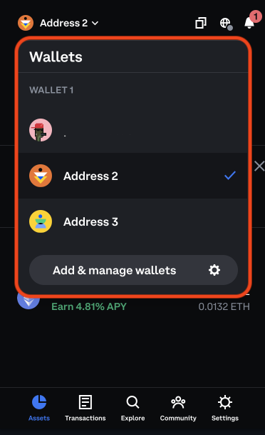

3. Copy the address of the newly selected wallet/account

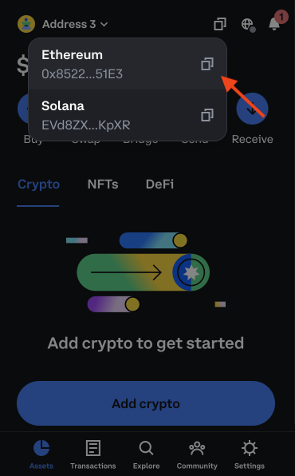

_Note: Each account will need funds in order to deploy contracts and interact with Base._

### Copy Private Key

_Do not share this with anyone._

1. Click on the Settings tab


2. Select "Developer Settings"


3. Click on "Show private key"

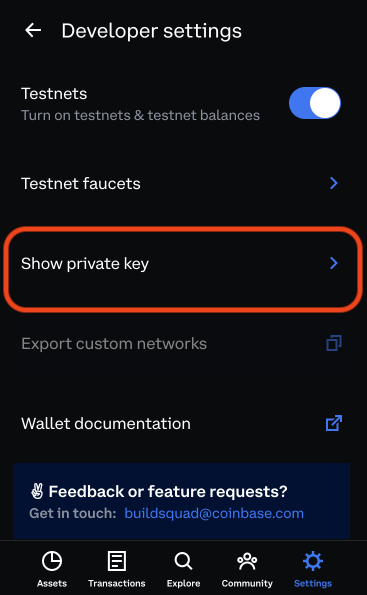

4. Enter password

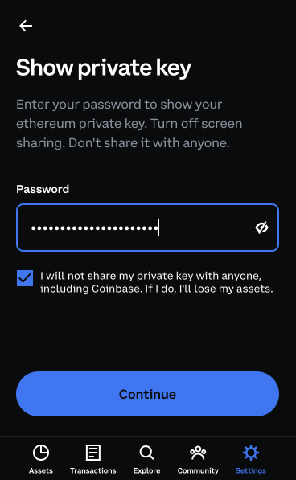

5. Read disclaimer to copy address

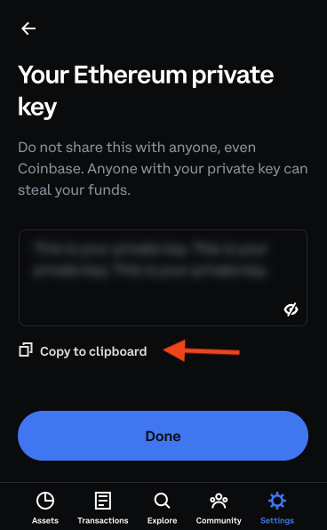

## Run Scripts

1. `npx hardhat run scripts/01_deploy_contracts.js --network base-goerli` will deploy all three smart contracts and save their deployment information in a file called `deploymentData.json`.

### Sample output:

```
ERC-721 Contract deployed at: 0xECD4b1C01a0aF70C7Ee985db389E294D01DffEC0
Saved deployment data to a new file: deploymentData.json
Deployed registry contract at: 0x58B2EAe6f05abf9C1e1566AD9307C67B41627A1e
[
  {
    NftContract: {
      address: '0xECD4b1C01a0aF70C7Ee985db389E294D01DffEC0',
      deployer: '0xB6d00D83158feE6695C72ff9c5E915478A465724',
      deploymentHash: '0xedacc11c5268b155a9a6918b5e1cc19031343f41519f596eb264ef6ca3feaeb4'
    }
  },
  {
    ERC6551Registry: {
      address: '0x58B2EAe6f05abf9C1e1566AD9307C67B41627A1e',
      deployer: '0xB6d00D83158feE6695C72ff9c5E915478A465724',
      deploymentHash: '0xcf45022f97e682eccc87c903c6eff38ba2c080aeb69c69da4662914aacf4f481'
    }
  }
]
Deployment data saved to: deploymentData.json
Deploying Token Bound Account
Token bound account deployed at: 0xdAcaEDF79Fa33405446F2B9Fbf820Cef84507f22
[
  {
    NftContract: {
      address: '0xECD4b1C01a0aF70C7Ee985db389E294D01DffEC0',
      deployer: '0xB6d00D83158feE6695C72ff9c5E915478A465724',
      deploymentHash: '0xedacc11c5268b155a9a6918b5e1cc19031343f41519f596eb264ef6ca3feaeb4'
    }
  },
  {
    ERC6551Registry: {
      address: '0x58B2EAe6f05abf9C1e1566AD9307C67B41627A1e',
      deployer: '0xB6d00D83158feE6695C72ff9c5E915478A465724',
      deploymentHash: '0xcf45022f97e682eccc87c903c6eff38ba2c080aeb69c69da4662914aacf4f481'
    }
  },
  {
    ERC6551Account: {
      address: '0xdAcaEDF79Fa33405446F2B9Fbf820Cef84507f22',
      deployer: '0xB6d00D83158feE6695C72ff9c5E915478A465724',
      deploymentHash: '0xbfe9ab08951e07660c2d3a6e9b16e6e959a174530f1e28aba9c98a19c381f586'
    }
  }
]
Deployment data saved to: deploymentData.json
```

2. `npx hardhat run scripts/02_mint_nft.js --network --network base-goerli` will mint an NFT and assign its ownership to the `WALLET2_ADDR` account

### Sample output:

```
0xECD4b1C01a0aF70C7Ee985db389E294D01DffEC0
Minting NFT...
TokenId 0 is owned by address: 0x9eEd71442F60440b39Def927047e5823c0b208D4
```

3. `npx hardhat run scripts/03_create_account.js --network base-goerli` will create and compute the address for a smart contract wallet

### Sample output:

```
Computed Address:  0xA5153E5D9A384e519fEa64D228797edb4a448d45
```

4. `npx hardhat run scripts/04_account_interaction.js --network base-goerli` will send funds from `WALLET_KEY` to the token bound account and transfer ownership of the NFT from `WALLET2_ADDR` to `WALLET_KEY`.

### Sample output:

```
Current owner of tokenId 0 is 0x9eEd71442F60440b39Def927047e5823c0b208D4
Token account has 0 ETH
New owner of tokenId 0 is 0xB6d00D83158feE6695C72ff9c5E915478A465724
Token account has 12500000000000000 ETH
```

# Congrats!
